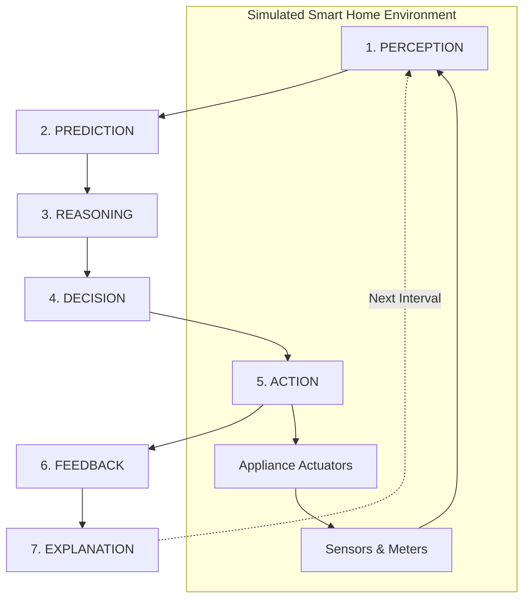

# Autonomous AI Agent Architecture Specification

> **Project**: Autonomous AI Agent for Smart Home Energy Optimization and Comfort Management  
> **System Scope**: Real-time closed-loop decision making balancing thermodynamic comfort, electricity tariffs, grid constraints, and user preferences.

---

## 1. Core Architectural Philosophy: The 7-Stage Cognitive Loop

This system is deliberately architected to transcend simplistic rule-based "if-then" automation (such as static thermostat thresholds). Instead, the agent operates as a **Goal-Oriented Autonomous Rational Agent** executing a continuous 7-stage cognitive loop:

---

## 2. Detailed Breakdown of the 7 Stages

### Stage 1: PERCEPTION (State Observation & Ingestion)
The agent continuously observes the physical and contextual environment:
- **Thermal State**: Indoor temperature ($T_{in}$), indoor humidity ($H_{in}$), outdoor weather conditions ($T_{out}$, solar irradiance $I_{sol}$).
- **Human Context**: Binary occupancy ($O \in \{0, 1\}$), room presence count, user comfort bounds $[T_{min}, T_{max}]$, target comfort preference $T_{target}$.
- **Grid & Financial Context**: Dynamic time-of-use tariff rate ($C_t$ in $\$ / \text{kWh}$), current grid demand tier (`OFF_PEAK`, `STANDARD`, `PEAK`, `CRITICAL_PEAK`).
- **Energy Context**: Current aggregate household power load ($P_{total}$ in $\text{kW}$), solar PV generation ($P_{pv}$), net grid import ($P_{grid} = \max(0, P_{total} - P_{pv})$).
- **Appliance States**: Status, setpoints, duty cycle runtime, and priorities of manageable devices (HVAC/AC, Heat Pump, Water Heater, EV Charger, Washing Machine, Dishwasher, Refrigerator).

### Stage 2: PREDICTION (Predictive Modeling & Forecasting)
Raw perception is fed into machine learning and physics-informed models to forecast future trajectory:
1. **Thermal Drift Model**: Predicts indoor temperature change $\Delta T_{in}$ over the next $\tau$ minutes given outdoor weather and cooling/heating actuation:
   $$\hat{T}_{in}(t + \Delta t) = f_{ML}(T_{in}(t), T_{out}(t), H(t), P_{HVAC}(t))$$
2. **Cooling/Heating Energy Requirement**: Predicts the thermal energy (kWh) required to bring or maintain the room within the comfort envelope.
3. **Price & Load Forecast**: Predicts upcoming tariff escalations within a rolling 2-4 hour lookahead horizon.
4. **Occupancy Probability**: Forecasts likelihood of upcoming arrival or departure based on historical behavioral patterns.

### Stage 3: REASONING (Multi-Objective Trade-off Analysis)
The agent evaluates competing objectives using a multi-attribute utility function. The three core tensions are:
- **Comfort Penalty ($J_{\text{comfort}}$)**:
  $$J_{\text{comfort}} = \alpha \cdot \mathbb{I}(\text{occupied}) \cdot \left| T_{in} - T_{\text{target}} \right|^2$$
  *(If unoccupied, comfort penalties drop significantly, allowing eco-drift).*
- **Cost Penalty ($J_{\text{cost}}$)**:
  $$J_{\text{cost}} = \beta \cdot C_t \cdot \sum_{i} P_i \cdot \Delta t$$
  *(Penalizes running high-draw appliances during expensive peak and critical peak pricing).*
- **Grid / Peak Load Penalty ($J_{\text{grid}}$)**:
  $$J_{\text{grid}} = \gamma \cdot \max(0, P_{total} - P_{\text{threshold}})^2$$
  *(Prevents household aggregate power from tripping limits or straining local transformers).*
- **Appliance Priority Weighting**:
  - `CRITICAL` (e.g. Refrigerator, Medical): Inviolable runtime constraints.
  - `HIGH` (e.g. Living room AC during occupancy): Strong comfort weighting.
  - `MEDIUM` (e.g. Water heater): Elastic, can pre-heat before peak rates.
  - `LOW` (e.g. EV charger, dishwasher): Shiftable, deferred to low-tariff periods.

### Stage 4: DECISION (Optimal Action Selection)
The agent constructs a candidate action space $\mathcal{A}$ across controllable devices:
- $a_{\text{AC}} \in \{\text{OFF}, \text{ECO}(24.5^\circ\text{C}), \text{OPTIMAL}(23.0^\circ\text{C}), \text{COMFORT}(21.5^\circ\text{C})\}$
- $a_{\text{EV}} \in \{\text{OFF}, \text{SLOW\_CHARGE}(3.3\text{kW}), \text{FAST\_CHARGE}(7.2\text{kW})\}$
- $a_{\text{WaterHeater}} \in \{\text{OFF}, \text{PREHEAT}, \text{MAINTAIN}\}$

The agent selects action $a^* \in \mathcal{A}$ that minimizes the global objective:
$$a^* = \arg\min_{a \in \mathcal{A}} \left[ J_{\text{comfort}}(a) + J_{\text{cost}}(a) + J_{\text{grid}}(a) \right]$$
subject to physical safety, priority constraints, and user override policies.

### Stage 5: ACTION (Actuation & Dispatch)
- Emits control signals to appliances via simulated device controllers.
- Adjusts AC setpoint, switches modes, throttles EV charging rate, or stages water heater cycles.
- Updates device state machine with timestamps, active power draw, and transition history.

### Stage 6: FEEDBACK (Observation & Self-Calibration)
At time $t + \Delta t$, the agent evaluates the real consequences of its decision:
- **Model Discrepancy Evaluation**: Did the actual indoor temperature drop as predicted by the thermal model?
  $$e_{\text{pred}} = |T_{actual} - \hat{T}_{predicted}|$$
- **Cost Incurred vs Budget**: Exact energy consumed vs estimated cost.
- **Online Adaptation**: Large discrepancies update model calibration weights or trigger re-training triggers.

### Stage 7: EXPLANATION (Human-Interpretable Transparency)
The agent synthesizes a clear, natural-language rationale explaining:
1. **What was observed** (e.g., "Outdoor temp is 34.5°C, room is occupied, and electricity tariff is currently in PEAK tier ($0.32/kWh).")
2. **What trade-off was identified** (e.g., "Immediate aggressive cooling would spike grid cost by 65% and approach the 8.5kW demand threshold.")
3. **Why this action was selected** (e.g., "Selected AC setpoint 23.5°C in ECO mode. This maintains occupant thermal comfort within 0.8°C of target while saving $0.48/hr and avoiding peak grid surcharges.")

---

## 3. Concrete Scenario: Peak Heat & High Tariff Case Study

| Step | State / Pipeline Stage | Concrete Realization |
| :--- | :--- | :--- |
| **1** | **Trigger** | Ambient temperature climbs to $35^\circ\text{C}$, indoor sensor measures $24.8^\circ\text{C}$. |
| **2** | **Perception** | Detects $T_{in}=24.8^\circ\text{C}$, $H_{in}=68\%$, Occupants = 2, Tariff = PEAK (\$0.32/kWh), Aggregate Load = 4.6 kW. |
| **3** | **Prediction** | Thermal model forecasts without cooling $T_{in} \to 26.5^\circ\text{C}$ in 30 mins; predicts 1.8 kWh cooling energy needed. |
| **4** | **Reasoning** | Evaluates 3 candidates: (A) Full Chill 21°C (\$0.77/hr, zero comfort penalty), (B) Turn Off (\$0/hr, severe discomfort), (C) Eco 23.5°C (\$0.38/hr, comfort maintained within tolerance). |
| **5** | **Decision** | Chooses Option C (Eco Setpoint $23.5^\circ\text{C}$) as utility optimizer yields highest score. |
| **6** | **Action** | Dispatches command: `AC.set_mode(mode='ECO', setpoint=23.5, compressor_speed=70%)`. |
| **7** | **Feedback** | 15 mins later, $T_{in}=23.8^\circ\text{C}$, power = 1.2 kW. Predicted $23.9^\circ\text{C}$ $\to$ error margin $+0.1^\circ\text{C}$. |
| **8** | **Explanation** | Outputs: *"Living room occupied with high outdoor heat during peak tariff. Selected ECO 23.5°C to preserve comfort while curtailing peak demand."* |

---

## 4. Agent Architecture Code Mapping

| Cognitive Stage | Backend Module | Primary Function / Class |
| :--- | :--- | :--- |
| Perception | `backend/app/agent/perception.py` | `PerceptionEngine.observe_state()` |
| Prediction | `backend/app/agent/prediction.py` | `PredictionEngine.forecast()` |
| Reasoning | `backend/app/agent/reasoning.py` | `ReasoningEngine.evaluate_tradeoffs()` |
| Decision | `backend/app/agent/decision.py` | `DecisionEngine.select_best_action()` |
| Action | `backend/app/agent/action.py` | `ActionDispatcher.execute()` |
| Feedback | `backend/app/agent/feedback.py` | `FeedbackEngine.record_outcome()` |
| Explanation | `backend/app/agent/explanation.py` | `ExplanationEngine.generate_rationale()` |
| Orchestrator | `backend/app/agent/core.py` | `AutonomousAgent.step()` |
