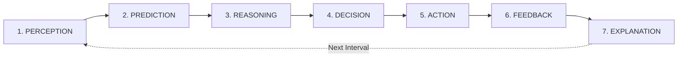

# Autonomous AI Agent for Smart Home Energy Optimization and Comfort Management

[](https://fastapi.tiangolo.com/)
[](https://react.dev/)
[](https://scikit-learn.org/)
[](https://www.sqlite.org/)
[](LICENSE)

An intelligent, software-based autonomous AI agent for residential energy management and occupant comfort optimization. Built for college AI competitions, this system goes beyond static rule-based thermostats by implementing a continuous, self-calibrating **7-Stage Cognitive Decision Loop**.

---

## 1. Project Vision & Core Innovation

Most "smart home" systems rely on trivial static rules (e.g., *"If temperature > 24°C, turn AC ON"*). These systems cause severe peak grid surges, ignore fluctuating time-of-use tariffs, and fail to anticipate building thermal inertia.

This project implements an **Autonomous Rational Agent** that resolves multi-objective trade-offs between:
- **Thermal Comfort**: Maintaining occupants within ASHRAE comfort envelopes based on real-time occupancy.
- **Electricity Costs**: Minimizing expenditures under dynamic Time-of-Use (TOU) and Critical Peak Pricing tariffs.
- **Peak Grid Load**: Flattening household demand curves to avoid transformer overloads.
- **Appliance Priority**: Distinguishing non-deferrable critical loads (refrigeration) from elastic shiftable loads (EV charging, water heating).

### The 7-Stage Cognitive Cycle
```
PERCEPTION → PREDICTION → REASONING → DECISION → ACTION → FEEDBACK → EXPLANATION
```



### Concrete Scenario: Peak Heat Wave During High Tariff
1. **Trigger**: Ambient temperature reaches $35^\circ\text{C}$; indoor sensor rises to $24.8^\circ\text{C}$.
2. **Perception**: Agent ingests temperature ($24.8^\circ\text{C}$), humidity ($65\%$), occupancy ($2\text{ occupants}$), tariff status (`PEAK` tier at $\$0.32/\text{kWh}$), and grid import ($4.6\text{ kW}$).
3. **Prediction**: ML thermal model forecasts temperature drift without cooling ($+1.7^\circ\text{C}$ in 15 mins) and calculates cooling demand ($1.8\text{ kWh}$).
4. **Reasoning**: Evaluates trade-off curves: aggressive chilling ($21^\circ\text{C}$) spikes costs by $65\%$; complete shutdown causes severe occupant discomfort.
5. **Decision**: Selects `ECO` mode ($24.0^\circ\text{C}$ setpoint) and defers non-critical EV charging.
6. **Action**: Actuates AC inverter setpoint to $24.0^\circ\text{C}$ and pauses Level 2 EV charging.
7. **Feedback**: 15 minutes post-action, indoor temperature stabilizes at $23.8^\circ\text{C}$, yielding a $94\%$ comfort satisfaction rating.
8. **Explanation**: Agent outputs a natural language rationale explaining why the trade-off saved $\$0.48/\text{hr}$ while preserving comfort.

---

## 2. Technology Stack

- **Backend**: Python 3.13+, FastAPI, Pydantic v2, SQLAlchemy 2.0 (Async + SQLite), WebSockets.
- **Machine Learning**: Scikit-Learn, Pandas, NumPy, Joblib (Random Forest thermal regressor & physics models).
- **Frontend**: React 18, Vite, Recharts, Lucide-react, Modern Dark Glassmorphic UI.
- **Protocols**: REST API (`/api/*`), WebSockets (`/ws/simulation`).

---

## 3. Directory Structure

```text
smart-home-ai-agent/
│
├── backend/
│   ├── app/
│   │   ├── agent/                 # 7-Stage Cognitive Architecture
│   │   │   ├── __init__.py
│   │   │   ├── action.py          # Stage 5: Device actuator dispatch
│   │   │   ├── core.py            # Main AutonomousAgent orchestrator
│   │   │   ├── decision.py        # Stage 4: Strategy & load shifting decision
│   │   │   ├── explanation.py     # Stage 7: Natural language explainer
│   │   │   ├── feedback.py        # Stage 6: Outcome observation & feedback
│   │   │   ├── perception.py      # Stage 1: Sensor & tariff state ingestion
│   │   │   ├── prediction.py      # Stage 2: ML thermal & energy forecasting
│   │   │   └── reasoning.py       # Stage 3: Multi-objective trade-off optimizer
│   │   ├── api/                   # REST & WebSocket Endpoints
│   │   │   ├── __init__.py
│   │   │   ├── routes.py          # REST endpoints (/status, /appliances, /step, /history)
│   │   │   └── websocket.py       # WebSocket streaming (/ws/simulation)
│   │   ├── database/              # SQLite & SQLAlchemy Layer
│   │   │   ├── __init__.py
│   │   │   ├── database.py        # Async engine & session provider
│   │   │   └── models.py          # Telemetry, appliance, & decision schemas
│   │   ├── ml/                    # ML Inference & Feature Engineering
│   │   │   ├── __init__.py
│   │   │   └── model_loader.py    # Model artifact loader with physics fallbacks
│   │   ├── simulator/             # Thermodynamic & Smart Home Multi-Room Simulator
│   │   │   ├── __init__.py
│   │   │   ├── appliances.py      # 7+ appliance state machines, runtimes, & power
│   │   │   ├── environment.py     # 3-room thermodynamic model & convective physics
│   │   │   ├── home_simulator.py  # Backward-compatible facade
│   │   │   ├── occupancy.py       # Realistic household routine & room distribution
│   │   │   ├── scenarios.py       # 7 predefined competition demo scenarios
│   │   │   ├── sensors.py         # Virtual IoT sensor network (temp, hum, lux, load)
│   │   │   ├── simulation_engine.py # Central controller (start, pause, reset, step)
│   │   │   ├── tariff.py          # Time-of-Use pricing tiers (₹4, ₹8, ₹12/kWh)
│   │   │   └── weather.py         # Diurnal ambient temperature & weather conditions
│   │   ├── __init__.py
│   │   ├── config.py              # Pydantic Settings (.env configuration)
│   │   └── main.py                # FastAPI entrypoint
│   ├── models/                    # Serialized ML artifacts (.joblib)
│   │   └── .gitkeep
│   ├── tests/                     # Automated Test Suites
│   │   ├── __init__.py
│   │   ├── test_agent.py          # Tests 7-stage cognitive step
│   │   ├── test_api.py            # Tests FastAPI REST endpoints
│   │   └── test_simulator.py      # Comprehensive 12-case simulator test suite
│   └── training/                  # ML Training Pipeline
│       ├── __init__.py
│       ├── sample_data_generator.py # Generates synthetic thermodynamic data
│       └── train.py               # Scikit-learn model training script
│
├── frontend/
│   ├── src/
│   │   ├── charts/                # Real-time Telemetry Charts (Recharts)
│   │   │   ├── EnergyChart.jsx    # Power demand vs Solar generation
│   │   │   └── TemperatureChart.jsx # Indoor vs Outdoor thermal tracking
│   │   ├── components/            # UI Components
│   │   │   ├── AgentReasoningBox.jsx # 7-stage interactive step inspector
│   │   │   ├── ApplianceCard.jsx  # Appliance fleet status & manual overrides
│   │   │   ├── Header.jsx         # Status bar, simulation clock, step trigger
│   │   │   └── MetricsSummary.jsx # Key telemetry KPI cards
│   │   ├── pages/
│   │   │   └── DashboardPage.jsx  # Master telemetry & control dashboard
│   │   ├── services/
│   │   │   ├── api.js             # REST API service client
│   │   │   └── websocket.js       # Auto-reconnecting WebSocket client
│   │   ├── App.jsx                # Application root
│   │   ├── index.css              # Custom dark glassmorphic styling
│   │   └── main.jsx               # React DOM entrypoint
│   ├── index.html
│   ├── package.json
│   └── vite.config.js
│
├── data/
│   ├── raw/                       # Raw datasets (.csv, .json)
│   ├── processed/                 # Feature-engineered training data
│   └── sample/                    # Baseline seed datasets
│       ├── smart_home_sample.json # Baseline household configuration
│       └── tariff_sample.json     # Time-of-Use schedule structure
│
├── docs/
│   ├── api_spec.md                # REST & WebSocket endpoint contracts
│   └── architecture.md            # System architecture & data flow
│
├── .env.example                   # Environment configuration template
├── .gitignore
├── AGENTS.md                      # Detailed Agent Cognitive Architecture Document
├── README.md                      # Project master documentation
└── requirements.txt               # Backend Python dependencies
```

---

## 4. Smart Home Environment Simulator

The simulation layer (`backend/app/simulator/`) provides physical, thermodynamic, behavioral, and electrical modeling of a residential home without relying on purely random numbers or simplistic counters.

### 1. Simulated Rooms
- **Living Room**: Largest thermal capacitance ($12.0\,\text{kWh}/^\circ\text{C}$), contains Inverter AC, Smart TV, and ambient lighting.
- **Bedroom**: Medium thermal mass ($8.0\,\text{kWh}/^\circ\text{C}$), contains Ceiling Fan and Bedroom Lights.
- **Kitchen**: Active thermal zone ($6.5\,\text{kWh}/^\circ\text{C}$), contains Inverter Refrigerator, Water Heater, Washing Machine, and Kitchen Lights.

### 2. Physical & Thermodynamic Modeling
- **Building Envelope**: Convective and radiative heat transfer with outdoor weather ($\dot{Q}_{\text{envelope}} = \frac{T_{\text{out}} - T_{\text{in}}}{R_{\text{env}}} \times \kappa_{\text{weather}}$).
- **Inter-Room Diffusion**: Thermal coupling simulates natural heat flow across adjoining walls.
- **Appliance Heat**: Waste heat generation ($40\%$ of active wattage) adds to internal thermal loads.
- **HVAC Cooling & Dehumidification**: Active cooling ($\text{kW} = P_{\text{electrical}} \times \text{COP}$) modulates temperature and actively extracts indoor moisture.
- **Ceiling Fan**: Provides convective air circulation and perceived comfort improvements without excessive thermal drop.

### 3. Virtual Sensor Network
- **Environmental**: High-precision simulated digital thermometers (noise $\pm0.04^\circ\text{C}$), relative hygrometers ($\pm0.15\%$), and ambient illuminance sensors (Lux).
- **Occupancy Motion Sensors**: PIR motion detection providing room-level and home-level occupant counts.
- **Smart Meter & Smart Plugs**: Total aggregate household wattage, per-appliance electrical power, and cumulative kWh counters.

### 4. Appliance Fleet
| Appliance | Room | Nominal Power | Priority | Comfort Impact | Min / Max Runtime |
| :--- | :--- | :--- | :--- | :--- | :--- |
| **Air Conditioner** | Living Room | $1500\,\text{W}$ | `HIGH` | `HIGH` | $10\,\text{m} / 360\,\text{m}$ |
| **Ceiling Fan** | Bedroom | $75\,\text{W}$ | `MEDIUM` | `MEDIUM` | $5\,\text{m} / 480\,\text{m}$ |
| **Living Room Lights** | Living Room | $15\,\text{W}$ | `LOW` | `LOW` | $1\,\text{m} / 720\,\text{m}$ |
| **Bedroom Lights** | Bedroom | $15\,\text{W}$ | `LOW` | `LOW` | $1\,\text{m} / 720\,\text{m}$ |
| **Kitchen Lights** | Kitchen | $20\,\text{W}$ | `LOW` | `LOW` | $1\,\text{m} / 720\,\text{m}$ |
| **Smart TV** | Living Room | $120\,\text{W}$ | `LOW` | `MEDIUM` | $15\,\text{m} / 300\,\text{m}$ |
| **Washing Machine** | Kitchen | $800\,\text{W}$ | `LOW` | `LOW` | $30\,\text{m} / 90\,\text{m}$ |
| **Water Heater** | Kitchen | $2000\,\text{W}$ | `MEDIUM` | `MEDIUM` | $15\,\text{m} / 180\,\text{m}$ |
| **Refrigerator** | Kitchen | $150\,\text{W}$ (avg) | `HIGH` | `LOW` | Continuous ($90\text{--}180\,\text{W}$) |

### 5. Time-of-Use (TOU) Tariff Model
Configured with three transparent tiers:
- **`OFF_PEAK`**: $₹4.0/\text{kWh}$ ($00:00\text{--}06:00$ and $22:00\text{--}24:00$)
- **`NORMAL`**: $₹8.0/\text{kWh}$ ($06:00\text{--}17:00$)
- **`PEAK`**: $₹12.0/\text{kWh}$ ($17:00\text{--}22:00$)

### 6. Occupancy Behavioral Schedule
- **$00:00\text{--}07:00$ (Night)**: Sleep in bedroom (occupancy active in bedroom; kitchen/living room empty).
- **$07:00\text{--}09:00$ (Morning)**: Preparation in kitchen and living room.
- **$09:00\text{--}17:00$ (Day)**: Work/school departure ($0$ or minimal occupants).
- **$17:00\text{--}23:00$ (Evening)**: High activity in living room and kitchen.
- **$23:00+$ (Wind-down)**: Migration back to bedroom.

### 7. Weather Simulation
- Diurnal outdoor temperature curve with natural peak around 15:00:
  - Morning: $22\text{--}26^\circ\text{C}$
  - Afternoon: $27\text{--}34^\circ\text{C}$
  - Evening: $25\text{--}30^\circ\text{C}$
  - Night: $22\text{--}27^\circ\text{C}$
- Weather Conditions: `SUNNY`, `CLOUDY`, `RAINY`, `HOT`, `MILD`.

### 8. Predefined Demo Scenarios
1. **Scenario 1 — Normal Home**: Baseline 24°C, 0 occupancy, AC OFF.
2. **Scenario 2 — Hot Occupied Room**: 29°C, 2 occupants, 70% humidity, AC OFF. High comfort demand.
3. **Scenario 3 — Empty Room**: 29°C, 0 occupants, AC ON. Wasteful cooling scenario.
4. **Scenario 4 — Peak Tariff**: PEAK tariff ($₹12/\text{kWh}$), multiple appliances running concurrently.
5. **Scenario 5 — High Energy Load**: AC, Water Heater, and Washing Machine all ON simultaneously ($>4300\,\text{W}$).
6. **Scenario 6 — Energy Anomaly**: Washing machine drawing abnormal $1700\,\text{W}$ (hardware malfunction simulation).
7. **Scenario 7 — User Override**: User manually forces AC ON contrary to agent policy; override state is strictly preserved.

### 9. Running Simulator Tests
Execute the standalone simulator test suite:
```bash
python -m pytest backend/tests/test_simulator.py -v
```

---

## 5. Local Installation Guide

### Prerequisites
- **Python 3.10+** (Python 3.13 tested)
- **Node.js 18+** (Node v24 tested) & **npm**

### Step 1: Clone the Repository & Configure Environment
```bash
# Clone the repository
git clone https://github.com/your-username/smart-home-ai-agent.git
cd smart-home-ai-agent

# Create local environment configuration
cp .env.example .env
```

### Step 2: Set Up Python Virtual Environment & Install Dependencies
```bash
# Create virtual environment
python -m venv .venv

# Activate virtual environment
# On Windows (PowerShell):
.venv\Scripts\Activate.ps1
# On Windows (cmd):
.venv\Scripts\activate.bat
# On Linux / macOS:
source .venv/bin/activate

# Install backend dependencies
python -m pip install --upgrade pip
pip install -r requirements.txt
```

### Step 3: Install Frontend Dependencies
```bash
cd frontend
npm install
cd ..
```

---

## 5. Running the Application Locally

### 1. Start the Backend Server (FastAPI + WebSocket)
With your Python virtual environment activated:
```bash
python -m uvicorn backend.app.main:app --host 127.0.0.1 --port 8000 --reload
```
- **REST API & Swagger Docs**: [http://127.0.0.1:8000/docs](http://127.0.0.1:8000/docs)
- **WebSocket Stream**: `ws://127.0.0.1:8000/ws/simulation`

### 2. Start the Frontend Development Server (React + Vite)
In a separate terminal window:
```bash
cd frontend
npm run dev
```
- **Web Dashboard**: [http://localhost:5173](http://localhost:5173)

---

## 6. Training the ML Model (Optional)

To train the Random Forest thermal drift prediction model on synthetic thermodynamic data:
```bash
python -m backend.training.train
```
This writes the trained model to `backend/models/thermal_model.joblib`. The agent automatically discovers this artifact at runtime; if absent, it gracefully falls back to physics-informed thermal equations.

---

## 7. Running Automated Tests

Run the backend unit and integration test suite:
```bash
python -m pytest backend/tests/
```

---

## 8. College AI Competition Evaluation Alignment

| Evaluation Dimension | Traditional Systems | Our Autonomous AI Agent |
| :--- | :--- | :--- |
| **Cognitive Breadth** | Single IF-THEN threshold | 7-stage continuous loop (`Perception → Prediction → Reasoning → Decision → Action → Feedback → Explanation`) |
| **Optimization** | Single-variable (temperature only) | Multi-objective Pareto optimization (Comfort + Cost + Peak Grid Load + Appliance Priority) |
| **Prediction** | Purely reactive (waits for heat) | Proactive ML regression estimating thermal drift and cooling energy horizons |
| **Grid Integration** | Unaware of grid strain | Dynamic TOU tariff awareness + automated non-critical load shifting (EV, water heating) |
| **Explainability** | Black box or silent | Natural language synthesis explaining the specific trade-offs of each action |
| **Self-Adaptation** | Static hardcoded parameters | Closes the loop via post-action feedback evaluation and tracking error metrics |
