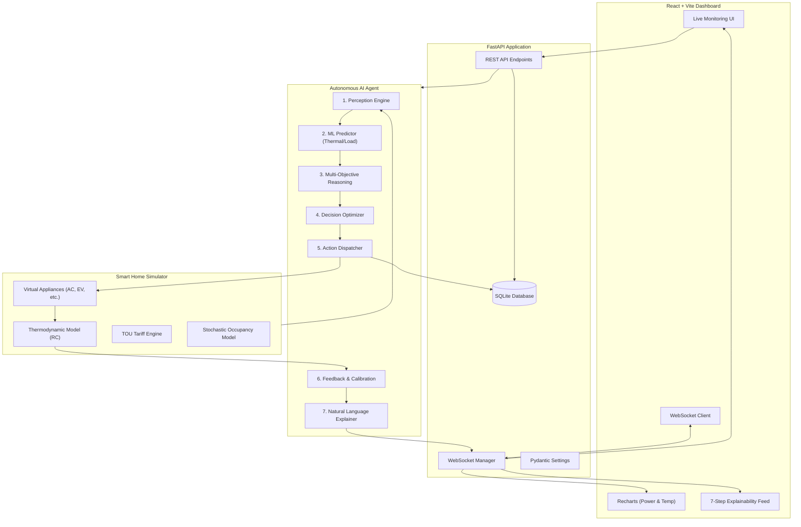

# System Architecture

## Overview
The Autonomous Smart Home Energy Optimization and Comfort Management platform consists of three main tiers:
1. **Simulation & Hardware Emulation Layer**: Simulates real-time thermodynamic thermal dynamics, human occupancy schedules, solar PV generation, and appliance electrical load profiles.
2. **AI Decision Brain**: Orchestrates perception, ML inference, multi-objective optimization, action dispatch, and explanation generation.
3. **Control & Monitoring Dashboard**: A modern React + Vite frontend communicating over low-latency WebSockets and REST APIs for real-time visualization and user supervision.

